# yolo-labrom

Scientific initiation project at LabRoM exploring YOLO's ability to segment transparent surfaces in images.

## LabRoM and Petrobras
This undergraduate research is conducted at LabRoM (Laboratório de Robótica Móvel), or the Mobile Robotics Laboratory, located in São Carlos, Brazil, at the University of São Paulo (USP). The lab is led by PhD. [Marcelo Becker](https://www.linkedin.com/in/marcelo-becker-761bb524/), and the research is supported by Petrobras, a Brazilian multinational corporation.

<table align="center">
  <tr>
    <td align="center">
      <a href="https://github.com/EESC-LabRoM" style="text-decoration: underline;">
        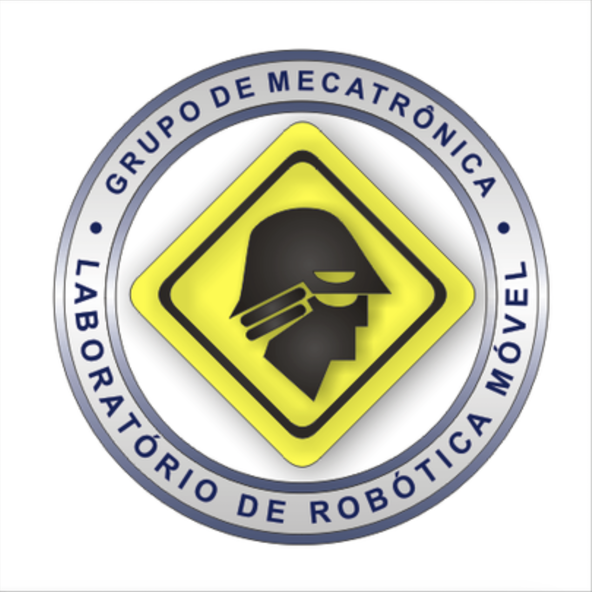<br>
        LabRoM
      </a>
    </td>
    <td align="center">
      <a href="https://petrobras.com.br/" style="text-decoration: underline;">
        <br>
        Petrobras
      </a>
    </td>
  </tr>
</table>


## The Project

### Motivation

Autonomous robots rely on various sensors to navigate their environment safely. One of the most commonly used sensors today is LiDAR, a laser-based technology that generates a 3D map of the surroundings by measuring light reflection. However, a significant challenge with LiDAR is its difficulty in detecting transparent surfaces. Since light passes through these surfaces, LiDAR struggles to accurately map or identify them, which can lead to crashes and damage to the robot.

<p align="center">
  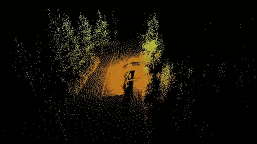
</p>
<p align="center">
  <a style="font-size: 12px; text-decoration: none; color: inherit;">
    Example of how LiDAR works.
  </a>
</p>

This project aims to evaluate how YOLO (You Only Look Once), a deep learning real-time object detection model [1], performs in segmenting transparent surfaces. The goal is to integrate YOLO's capabilities with LiDAR to enhance the robot’s navigation system, enabling it to better detect and avoid transparent obstacles.

### Dataset

The dataset chosen for this project is Trans10K by Xie et al. [2]. It consists of 10,428 images of transparent objects and surfaces, including items such as cups, bowls, windows, doors, walls, and more. Additional information about the dataset and the project can be found on the [project's GitHub page](https://github.com/xieenze/Segment_Transparent_Objects).

<table align="center" style="border-collapse: collapse;">
  <tr>
    <td style="padding: 0;">
      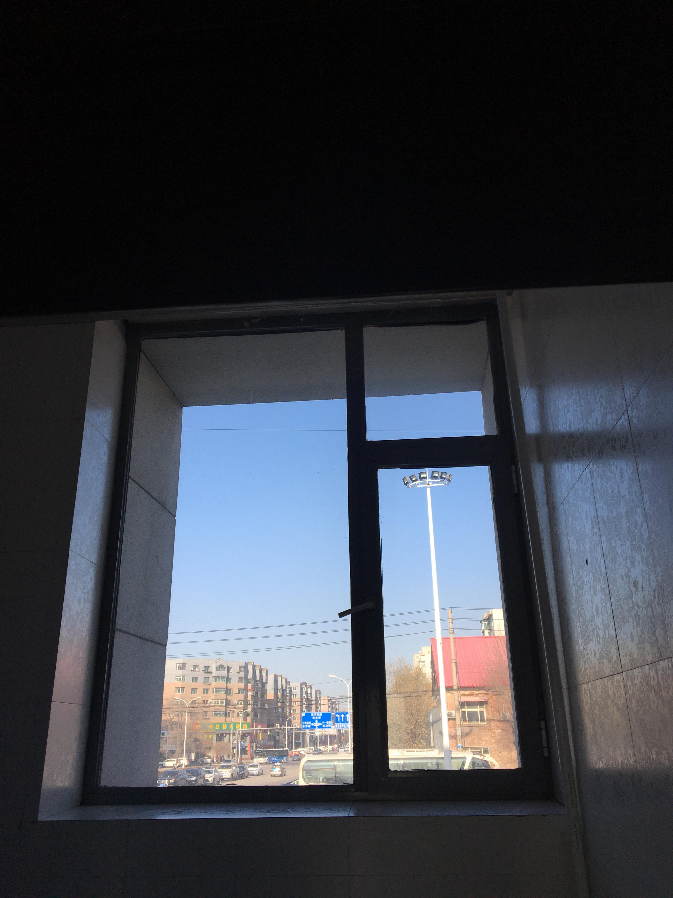
    </td>
    <td style="padding: 0;">
      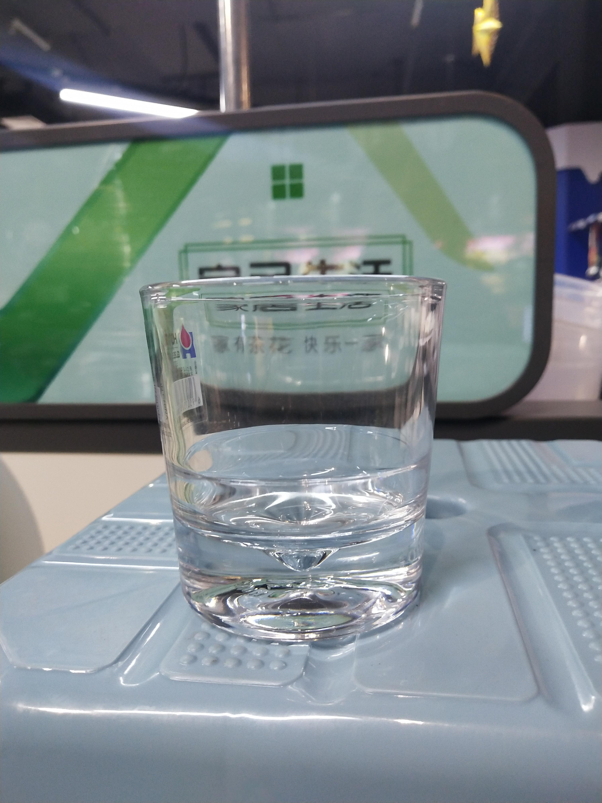
    </td>
    <td style="padding: 0;">
      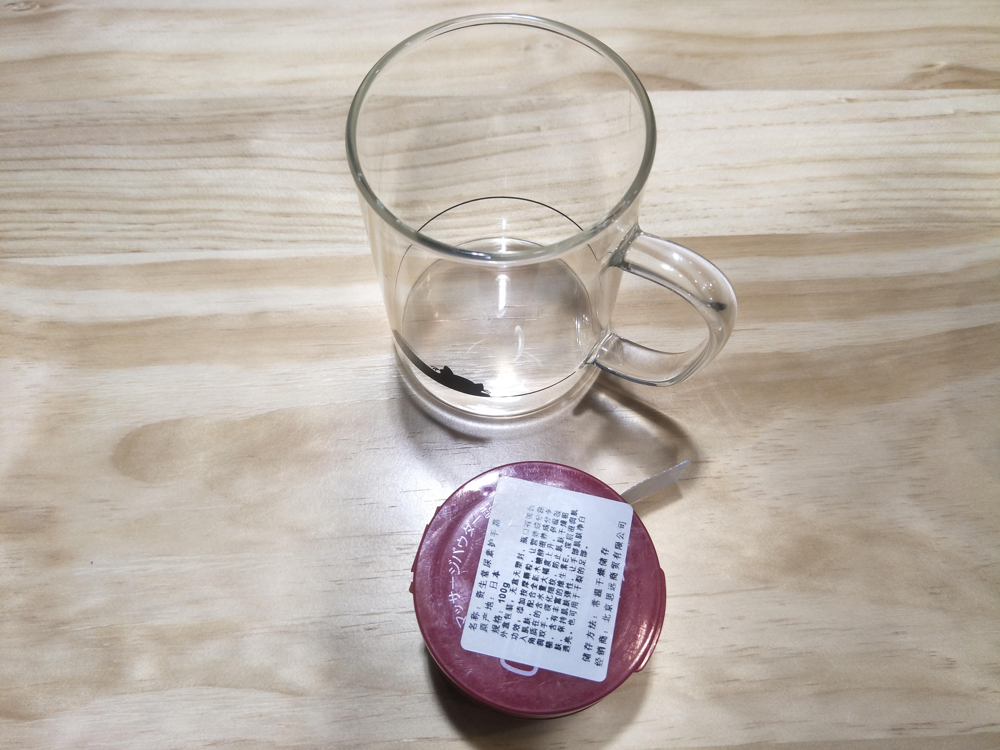
    </td>
  </tr>
  <tr>
    <td style="padding: 0;">
      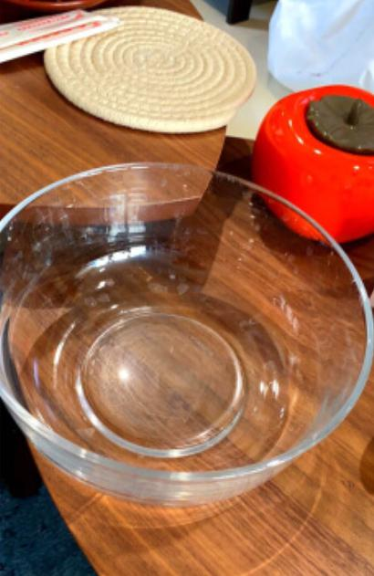
    </td>
    <td style="padding: 0;">
      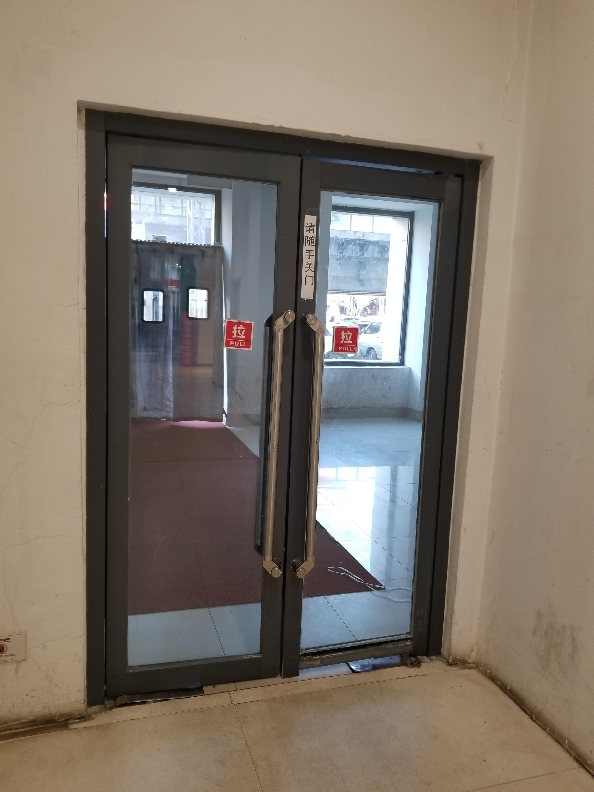
    </td>
    <td style="padding: 0;">
      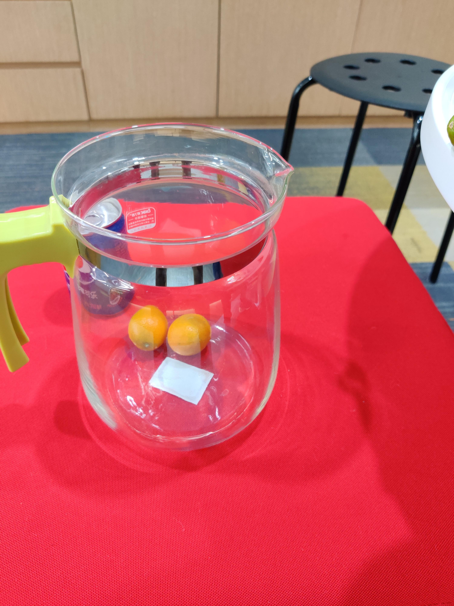
    </td>
  </tr>
  <tr>
    <td style="padding: 0;">
      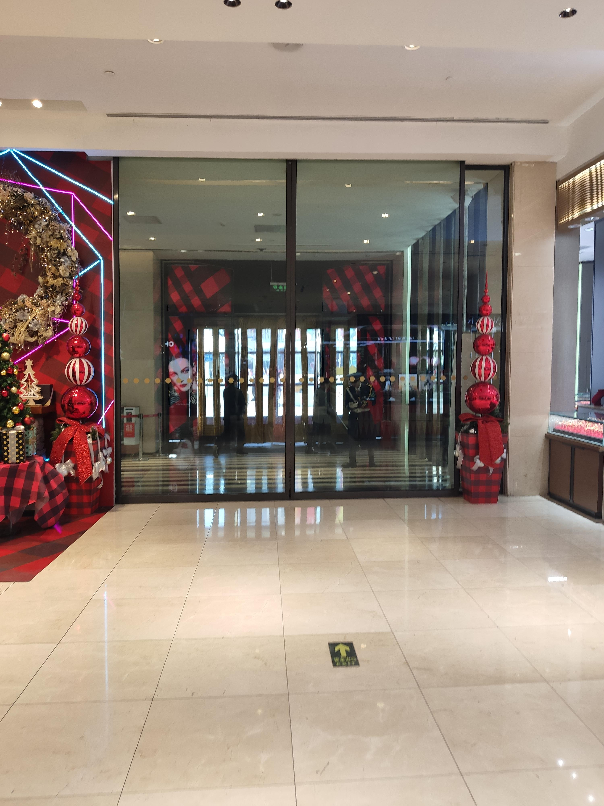
    </td>
    <td style="padding: 0;">
      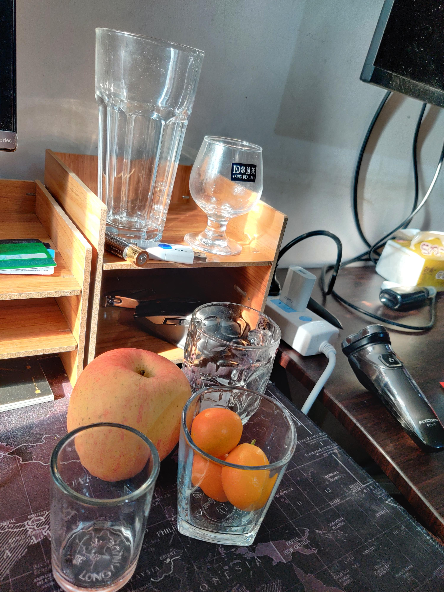
    </td>
    <td style="padding: 0;">
      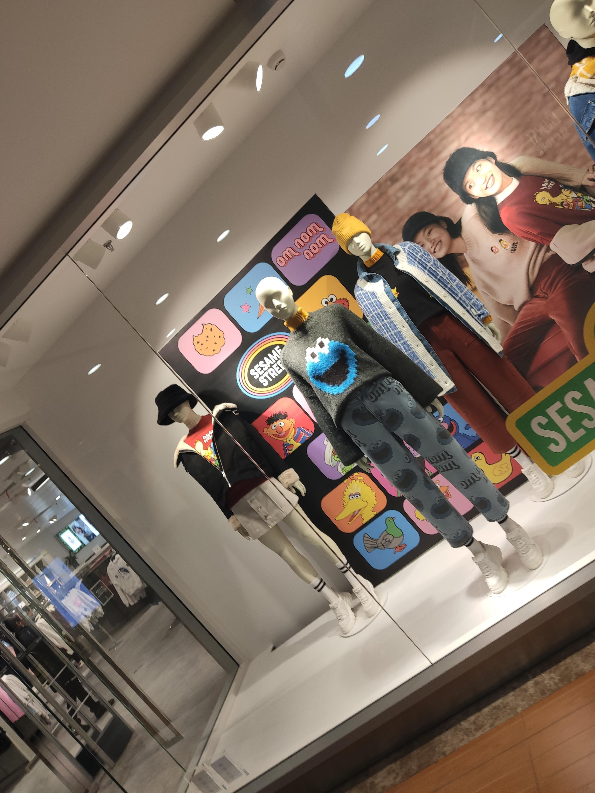
    </td>
  </tr>
</table>

<p style="text-align: center;">Some images of the Trans10K dataset showing different examples of transparent objects and surfaces.</p>

## YOLO: The State of the Art in Computer Vision

### Workflow 

Describe workflow here.


## Python Environment

To set up the environment needed:

```shell
python3 -m venv yolo_env
source yolo_env/bin/activate
```

Installing all dependencies needed:
```shell
pip install -r requirements.txt
```

Exiting the environment:
```shell
deactivate
```

## References
- [1] G. Jocher and J. Qiu, “Ultralytics yolo11,” 2024. [Online]. Available: https:
//github.com/ultralytics/ultralytics
- [2] Xie, W. Wang, W. Wang, M. Ding, C. Shen, and P. Luo, “Segmenting transparent objects in the wild,” arXiv preprint arXiv:2003.13948, 2020.